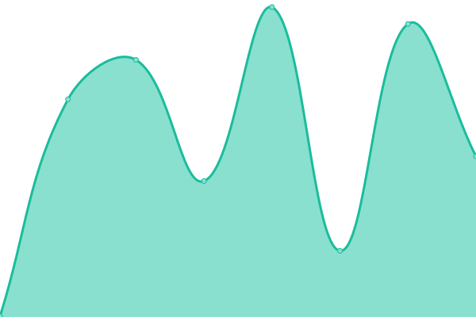
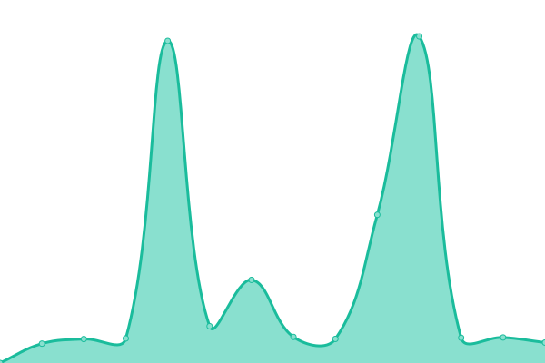
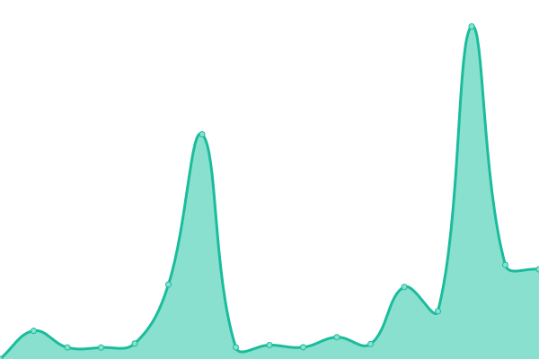

<!--start: status pages-->
<!-- This summary is generated by Upptime (https://github.com/upptime/upptime) -->
<!-- Do not edit this manually, your changes will be overwritten -->
<!-- prettier-ignore -->
| URL | Status | History | Response Time | Uptime |
| --- | ------ | ------- | ------------- | ------ |
|  [Main](http://boomhost.ml/index.php) | 🟥 Down | [main.yml](https://github.com/pythoniaweb/statusboom/commits/HEAD/history/main.yml) | 

 468ms
     
 | 

<a href="https://status.boomhost.ml/history/main">14.25%</a>
    

|  [Client Area](http://area.boomhost.ml/login.php) | 🟥 Down | [client-area.yml](https://github.com/pythoniaweb/statusboom/commits/HEAD/history/client-area.yml) | 

 762ms
     
 | 

<a href="https://status.boomhost.ml/history/client-area">14.25%</a>
    

|  [Status Page](http://status.boomhost.ml/index.html) | 🟩 Up | [status-page.yml](https://github.com/pythoniaweb/statusboom/commits/HEAD/history/status-page.yml) | 

 4336ms
     
 | 

<a href="https://status.boomhost.ml/history/status-page">80.16%</a>
    

|  [BoomHost FTP](http://myftp.boomhost.ml/index.html) | 🟩 Up | [boom-host-ftp.yml](https://github.com/pythoniaweb/statusboom/commits/HEAD/history/boom-host-ftp.yml) | 

 4498ms
     
 | 

<a href="https://status.boomhost.ml/history/boom-host-ftp">96.57%</a>
    

|  [cPanel](https://cpanel.boomhost.ml) | 🟥 Down | [c-panel.yml](https://github.com/pythoniaweb/statusboom/commits/HEAD/history/c-panel.yml) | 

 803ms
     
 | 

<a href="https://status.boomhost.ml/history/c-panel">14.25%</a>
    

|  [MySQL](http://mysql.boomhost.ml/index.html) | 🟩 Up | [my-sql.yml](https://github.com/pythoniaweb/statusboom/commits/HEAD/history/my-sql.yml) | 

 4171ms
     
 | 

<a href="https://status.boomhost.ml/history/my-sql">98.41%</a>
    

|  [WHM Api](https://cpanel.boomhost.ml) | 🟥 Down | [whm-api.yml](https://github.com/pythoniaweb/statusboom/commits/HEAD/history/whm-api.yml) | 

 157ms
     
 | 

<a href="https://status.boomhost.ml/history/whm-api">14.26%</a>
    

|  [cPanel File Manager](https://filemanager.ai/new/) | 🟩 Up | [c-panel-file-manager.yml](https://github.com/pythoniaweb/statusboom/commits/HEAD/history/c-panel-file-manager.yml) | 

 864ms
     
 | 

<a href="https://status.boomhost.ml/history/c-panel-file-manager">100.00%</a>
    

|  [Node 1](http://nodea.boomhost.ml/index.html) | 🟩 Up | [node-1.yml](https://github.com/pythoniaweb/statusboom/commits/HEAD/history/node-1.yml) | 

 3344ms
     
 | 

<a href="https://status.boomhost.ml/history/node-1">98.70%</a>
    

|  [Node 2](http://nodeb.boomhost.ml/index.html) | 🟩 Up | [node-2.yml](https://github.com/pythoniaweb/statusboom/commits/HEAD/history/node-2.yml) | 

 3611ms
     
 | 

<a href="https://status.boomhost.ml/history/node-2">98.90%</a>
    

<!--end: status pages-->

[**Visit our status website →**](https://status.boomhost.ml)

## 📄 License

- Powered by: [Upptime](https://github.com/upptime/upptime)
- Code: [MIT](./LICENSE) © [plurryt](https://fireurl.ga)
- Data in the `./history` directory: [Open Database License](https://opendatacommons.org/licenses/odbl/1-0/)
