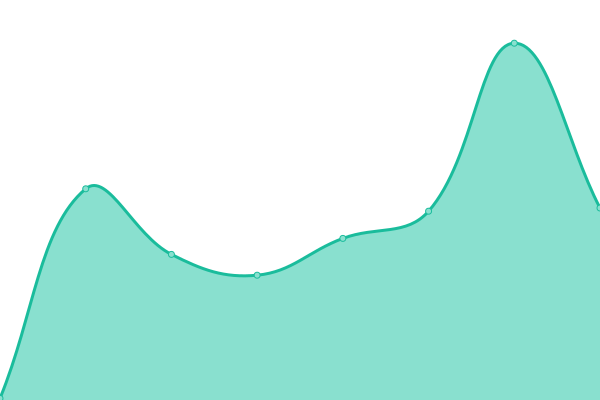
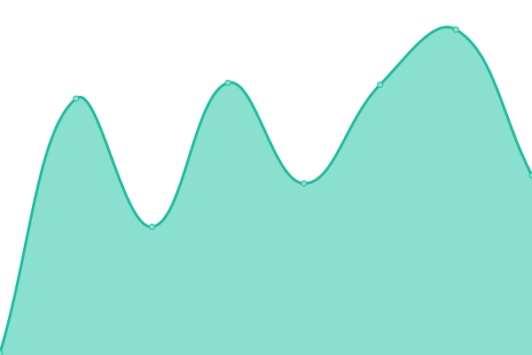
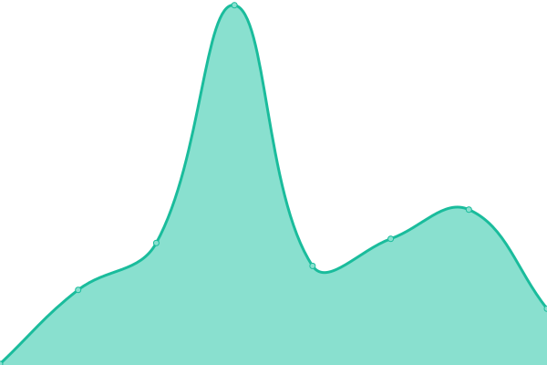
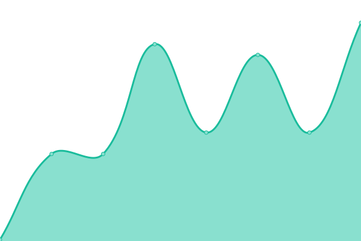
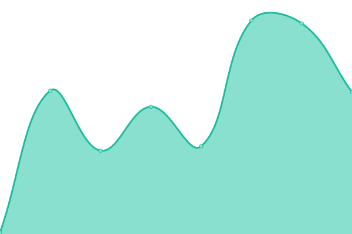
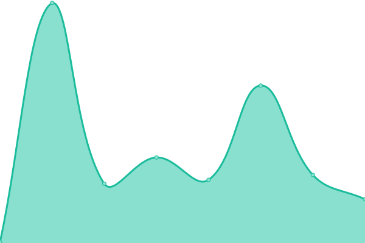
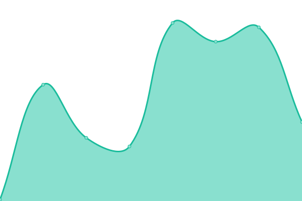
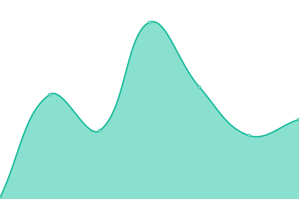
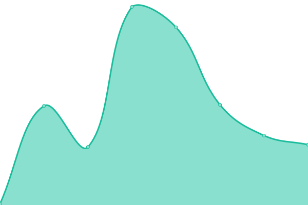
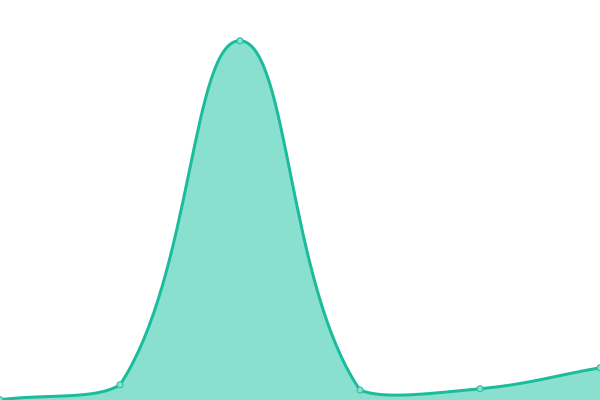

<!--start: status pages-->
<!-- This summary is generated by Upptime (https://github.com/upptime/upptime) -->
<!-- Do not edit this manually, your changes will be overwritten -->
<!-- prettier-ignore -->
| URL | Status | History | Response Time | Uptime |
| --- | ------ | ------- | ------------- | ------ |
|  [Roblox site](https://www.roblox.com/) | 🟩 Up | [roblox-site.yml](https://github.com/pythoniaweb/statusboom/commits/HEAD/history/roblox-site.yml) | 

 1193ms
     
 | 

<a href="https://pythoniaweb.github.io/statusboom/history/roblox-site">100.00%</a>
    

|  [Talant Roblox](https://talent.roblox.com/) | 🟩 Up | [talant-roblox.yml](https://github.com/pythoniaweb/statusboom/commits/HEAD/history/talant-roblox.yml) | 

 314ms
     
 | 

<a href="https://pythoniaweb.github.io/statusboom/history/talant-roblox">100.00%</a>
    

|  [Thumbnail's Api](https://thumbnails.roblox.com/) | 🟩 Up | [thumbnail-s-api.yml](https://github.com/pythoniaweb/statusboom/commits/HEAD/history/thumbnail-s-api.yml) | 

 680ms
     
 | 

<a href="https://pythoniaweb.github.io/statusboom/history/thumbnail-s-api">100.00%</a>
    

|  [Asset's Delivery](https://assetdelivery.roblox.com/) | 🟩 Up | [asset-s-delivery.yml](https://github.com/pythoniaweb/statusboom/commits/HEAD/history/asset-s-delivery.yml) | 

 693ms
     
 | 

<a href="https://pythoniaweb.github.io/statusboom/history/asset-s-delivery">100.00%</a>
    

|  [Game Join Api](http://gamejoin.roblox.com/) | 🟩 Up | [game-join-api.yml](https://github.com/pythoniaweb/statusboom/commits/HEAD/history/game-join-api.yml) | 

 1095ms
     
 | 

<a href="https://pythoniaweb.github.io/statusboom/history/game-join-api">100.00%</a>
    

|  [2FA Api](https://twostepverification.roblox.com/) | 🟩 Up | [2-fa-api.yml](https://github.com/pythoniaweb/statusboom/commits/HEAD/history/2-fa-api.yml) | 

 679ms
     
 | 

<a href="https://pythoniaweb.github.io/statusboom/history/2-fa-api">100.00%</a>
    

|  [Account Settings](https://accountsettings.roblox.com/) | 🟩 Up | [account-settings.yml](https://github.com/pythoniaweb/statusboom/commits/HEAD/history/account-settings.yml) | 

 673ms
     
 | 

<a href="https://pythoniaweb.github.io/statusboom/history/account-settings">100.00%</a>
    

|  [Voice Api](https://voice.roblox.com/) | 🟩 Up | [voice-api.yml](https://github.com/pythoniaweb/statusboom/commits/HEAD/history/voice-api.yml) | 

 676ms
     
 | 

<a href="https://pythoniaweb.github.io/statusboom/history/voice-api">100.00%</a>
    

|  [Account Info](https://accountinformation.roblox.com/) | 🟩 Up | [account-info.yml](https://github.com/pythoniaweb/statusboom/commits/HEAD/history/account-info.yml) | 

 672ms
     
 | 

<a href="https://pythoniaweb.github.io/statusboom/history/account-info">100.00%</a>
    

|  [Auth Api](https://auth.roblox.com/) | 🟩 Up | [auth-api.yml](https://github.com/pythoniaweb/statusboom/commits/HEAD/history/auth-api.yml) | 

 668ms
     
 | 

<a href="https://pythoniaweb.github.io/statusboom/history/auth-api">100.00%</a>
    

|  [Private Message Api](https://privatemessages.roblox.com/) | 🟩 Up | [private-message-api.yml](https://github.com/pythoniaweb/statusboom/commits/HEAD/history/private-message-api.yml) | 

 661ms
     
 | 

<a href="https://pythoniaweb.github.io/statusboom/history/private-message-api">100.00%</a>
    

|  [Chat Api](https://chat.roblox.com/) | 🟩 Up | [chat-api.yml](https://github.com/pythoniaweb/statusboom/commits/HEAD/history/chat-api.yml) | 

 672ms
     
 | 

<a href="https://pythoniaweb.github.io/statusboom/history/chat-api">100.00%</a>
    

|  [Friends Api](https://friends.roblox.com/) | 🟩 Up | [friends-api.yml](https://github.com/pythoniaweb/statusboom/commits/HEAD/history/friends-api.yml) | 

 675ms
     
 | 

<a href="https://pythoniaweb.github.io/statusboom/history/friends-api">100.00%</a>
    

|  [Billing Api](https://billing.roblox.com/) | 🟩 Up | [billing-api.yml](https://github.com/pythoniaweb/statusboom/commits/HEAD/history/billing-api.yml) | 

 671ms
     
 | 

<a href="https://pythoniaweb.github.io/statusboom/history/billing-api">100.00%</a>
    

|  [Roblox Docs](https://create.roblox.com/docs/reference/engine) | 🟩 Up | [roblox-docs.yml](https://github.com/pythoniaweb/statusboom/commits/HEAD/history/roblox-docs.yml) | 

 155ms
     
 | 

<a href="https://pythoniaweb.github.io/statusboom/history/roblox-docs">100.00%</a>
    

|  [Games Api](https://games.roblox.com/) | 🟩 Up | [games-api.yml](https://github.com/pythoniaweb/statusboom/commits/HEAD/history/games-api.yml) | 

 659ms
     
 | 

<a href="https://pythoniaweb.github.io/statusboom/history/games-api">100.00%</a>
    

|  [User's Api](https://users.roblox.com/) | 🟩 Up | [user-s-api.yml](https://github.com/pythoniaweb/statusboom/commits/HEAD/history/user-s-api.yml) | 

 667ms
     
 | 

<a href="https://pythoniaweb.github.io/statusboom/history/user-s-api">100.00%</a>
    

|  [Inventory Api](https://inventory.roblox.com/) | 🟩 Up | [inventory-api.yml](https://github.com/pythoniaweb/statusboom/commits/HEAD/history/inventory-api.yml) | 

 673ms
     
 | 

<a href="https://pythoniaweb.github.io/statusboom/history/inventory-api">100.00%</a>
    

|  [Data Storage Api](https://gamepersistence.roblox.com/) | 🟩 Up | [data-storage-api.yml](https://github.com/pythoniaweb/statusboom/commits/HEAD/history/data-storage-api.yml) | 

 666ms
     
 | 

<a href="https://pythoniaweb.github.io/statusboom/history/data-storage-api">100.00%</a>
    

|  [Developer Api](https://develop.roblox.com/) | 🟩 Up | [developer-api.yml](https://github.com/pythoniaweb/statusboom/commits/HEAD/history/developer-api.yml) | 

 661ms
     
 | 

<a href="https://pythoniaweb.github.io/statusboom/history/developer-api">100.00%</a>
    

|  [Groups Api](https://groups.roblox.com/) | 🟩 Up | [groups-api.yml](https://github.com/pythoniaweb/statusboom/commits/HEAD/history/groups-api.yml) | 

 683ms
     
 | 

<a href="https://pythoniaweb.github.io/statusboom/history/groups-api">100.00%</a>
    

|  [Contact's Api](https://contacts.roblox.com/) | 🟩 Up | [contact-s-api.yml](https://github.com/pythoniaweb/statusboom/commits/HEAD/history/contact-s-api.yml) | 

 666ms
     
 | 

<a href="https://pythoniaweb.github.io/statusboom/history/contact-s-api">100.00%</a>
    

|  [Catalog Api](https://catalog.roblox.com/) | 🟩 Up | [catalog-api.yml](https://github.com/pythoniaweb/statusboom/commits/HEAD/history/catalog-api.yml) | 

 662ms
     
 | 

<a href="https://pythoniaweb.github.io/statusboom/history/catalog-api">100.00%</a>
    

|  [Dev Forum](https://devforum.roblox.com/) | 🟩 Up | [dev-forum.yml](https://github.com/pythoniaweb/statusboom/commits/HEAD/history/dev-forum.yml) | 

 482ms
     
 | 

<a href="https://pythoniaweb.github.io/statusboom/history/dev-forum">100.00%</a>
    

|  [Avatar Api](https://avatar.roblox.com/) | 🟩 Up | [avatar-api.yml](https://github.com/pythoniaweb/statusboom/commits/HEAD/history/avatar-api.yml) | 

 674ms
     
 | 

<a href="https://pythoniaweb.github.io/statusboom/history/avatar-api">100.00%</a>
    

|  [Economy Api](https://economy.roblox.com/) | 🟩 Up | [economy-api.yml](https://github.com/pythoniaweb/statusboom/commits/HEAD/history/economy-api.yml) | 

 659ms
     
 | 

<a href="https://pythoniaweb.github.io/statusboom/history/economy-api">100.00%</a>
    

|  [Premium Future's Api](https://premiumfeatures.roblox.com/) | 🟩 Up | [premium-future-s-api.yml](https://github.com/pythoniaweb/statusboom/commits/HEAD/history/premium-future-s-api.yml) | 

 672ms
     
 | 

<a href="https://pythoniaweb.github.io/statusboom/history/premium-future-s-api">100.00%</a>
    

|  [Badge's Api](https://badges.roblox.com/) | 🟩 Up | [badge-s-api.yml](https://github.com/pythoniaweb/statusboom/commits/HEAD/history/badge-s-api.yml) | 

 663ms
     
 | 

<a href="https://pythoniaweb.github.io/statusboom/history/badge-s-api">100.00%</a>
    

<!--end: status pages-->

## 📄 License

- Powered by: [Upptime](https://github.com/upptime/upptime)
- Code: [MIT](./LICENSE) © [plurryt](https://fireurl.ga)
- Data in the `./history` directory: [Open Database License](https://opendatacommons.org/licenses/odbl/1-0/)
