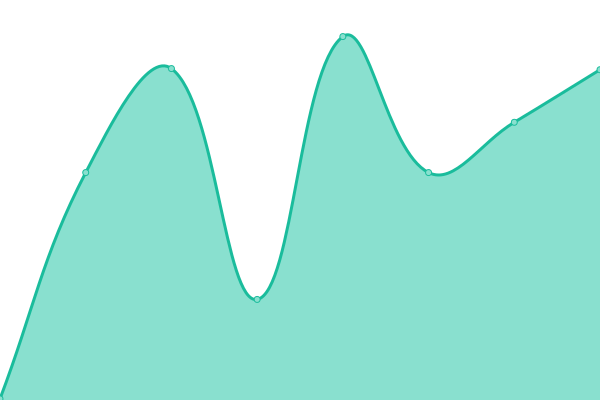

<!--start: status pages-->
<!-- This summary is generated by Upptime (https://github.com/upptime/upptime) -->
<!-- Do not edit this manually, your changes will be overwritten -->
<!-- prettier-ignore -->
| URL | Status | History | Response Time | Uptime |
| --- | ------ | ------- | ------------- | ------ |
|  [Roblox site](https://www.roblox.com/) | 🟩 Up | [roblox-site.yml](https://github.com/pythoniaweb/statusboom/commits/HEAD/history/roblox-site.yml) | 

 220ms
     
 | 

<a href="https://pythoniaweb.github.io/statusboom/history/roblox-site">100.00%</a>
    

|  [Talant Roblox](https://talent.roblox.com/) | 🟩 Up | [talant-roblox.yml](https://github.com/pythoniaweb/statusboom/commits/HEAD/history/talant-roblox.yml) | 

 320ms
     
 | 

<a href="https://pythoniaweb.github.io/statusboom/history/talant-roblox">100.00%</a>
    

|  [Thumbnail's Api](https://thumbnails.roblox.com/) | 🟥 Down | [thumbnail-s-api.yml](https://github.com/pythoniaweb/statusboom/commits/HEAD/history/thumbnail-s-api.yml) | 

 145ms
     
 | 

<a href="https://pythoniaweb.github.io/statusboom/history/thumbnail-s-api">25.13%</a>
    

|  [Asset's Delivery](https://assetdelivery.roblox.com/) | 🟥 Down | [asset-s-delivery.yml](https://github.com/pythoniaweb/statusboom/commits/HEAD/history/asset-s-delivery.yml) | 

 139ms
     
 | 

<a href="https://pythoniaweb.github.io/statusboom/history/asset-s-delivery">23.48%</a>
    

|  [Game Join Api](http://gamejoin.roblox.com/) | 🟥 Down | [game-join-api.yml](https://github.com/pythoniaweb/statusboom/commits/HEAD/history/game-join-api.yml) | 

 185ms
     
 | 

<a href="https://pythoniaweb.github.io/statusboom/history/game-join-api">26.52%</a>
    

|  [2FA Api](https://twostepverification.roblox.com/) | 🟩 Up | [2-fa-api.yml](https://github.com/pythoniaweb/statusboom/commits/HEAD/history/2-fa-api.yml) | 

 128ms
     
 | 

<a href="https://pythoniaweb.github.io/statusboom/history/2-fa-api">25.34%</a>
    

|  [Account Settings](https://accountsettings.roblox.com/) | 🟩 Up | [account-settings.yml](https://github.com/pythoniaweb/statusboom/commits/HEAD/history/account-settings.yml) | 

 128ms
     
 | 

<a href="https://pythoniaweb.github.io/statusboom/history/account-settings">24.95%</a>
    

|  [Voice Api](https://voice.roblox.com/) | 🟥 Down | [voice-api.yml](https://github.com/pythoniaweb/statusboom/commits/HEAD/history/voice-api.yml) | 

 133ms
     
 | 

<a href="https://pythoniaweb.github.io/statusboom/history/voice-api">24.16%</a>
    

|  [Account Info](https://accountinformation.roblox.com/) | 🟥 Down | [account-info.yml](https://github.com/pythoniaweb/statusboom/commits/HEAD/history/account-info.yml) | 

 124ms
     
 | 

<a href="https://pythoniaweb.github.io/statusboom/history/account-info">23.74%</a>
    

|  [Auth Api](https://auth.roblox.com/) | 🟥 Down | [auth-api.yml](https://github.com/pythoniaweb/statusboom/commits/HEAD/history/auth-api.yml) | 

 129ms
     
 | 

<a href="https://pythoniaweb.github.io/statusboom/history/auth-api">24.65%</a>
    

|  [Private Message Api](https://privatemessages.roblox.com/) | 🟥 Down | [private-message-api.yml](https://github.com/pythoniaweb/statusboom/commits/HEAD/history/private-message-api.yml) | 

 117ms
     
 | 

<a href="https://pythoniaweb.github.io/statusboom/history/private-message-api">24.48%</a>
    

|  [Chat Api](https://chat.roblox.com/) | 🟥 Down | [chat-api.yml](https://github.com/pythoniaweb/statusboom/commits/HEAD/history/chat-api.yml) | 

 120ms
     
 | 

<a href="https://pythoniaweb.github.io/statusboom/history/chat-api">25.16%</a>
    

|  [Friends Api](https://friends.roblox.com/) | 🟥 Down | [friends-api.yml](https://github.com/pythoniaweb/statusboom/commits/HEAD/history/friends-api.yml) | 

 122ms
     
 | 

<a href="https://pythoniaweb.github.io/statusboom/history/friends-api">23.71%</a>
    

|  [Billing Api](https://billing.roblox.com/) | 🟥 Down | [billing-api.yml](https://github.com/pythoniaweb/statusboom/commits/HEAD/history/billing-api.yml) | 

 119ms
     
 | 

<a href="https://pythoniaweb.github.io/statusboom/history/billing-api">24.53%</a>
    

|  [Roblox Docs](https://create.roblox.com/docs/reference/engine) | 🟩 Up | [roblox-docs.yml](https://github.com/pythoniaweb/statusboom/commits/HEAD/history/roblox-docs.yml) | 

 144ms
     
 | 

<a href="https://pythoniaweb.github.io/statusboom/history/roblox-docs">100.00%</a>
    

|  [Games Api](https://games.roblox.com/) | 🟩 Up | [games-api.yml](https://github.com/pythoniaweb/statusboom/commits/HEAD/history/games-api.yml) | 

 127ms
     
 | 

<a href="https://pythoniaweb.github.io/statusboom/history/games-api">23.82%</a>
    

|  [User's Api](https://users.roblox.com/) | 🟥 Down | [user-s-api.yml](https://github.com/pythoniaweb/statusboom/commits/HEAD/history/user-s-api.yml) | 

 113ms
     
 | 

<a href="https://pythoniaweb.github.io/statusboom/history/user-s-api">24.82%</a>
    

|  [Inventory Api](https://inventory.roblox.com/) | 🟩 Up | [inventory-api.yml](https://github.com/pythoniaweb/statusboom/commits/HEAD/history/inventory-api.yml) | 

 121ms
     
 | 

<a href="https://pythoniaweb.github.io/statusboom/history/inventory-api">26.00%</a>
    

|  [Data Storage Api](https://gamepersistence.roblox.com/) | 🟥 Down | [data-storage-api.yml](https://github.com/pythoniaweb/statusboom/commits/HEAD/history/data-storage-api.yml) | 

 123ms
     
 | 

<a href="https://pythoniaweb.github.io/statusboom/history/data-storage-api">25.85%</a>
    

|  [Developer Api](https://develop.roblox.com/) | 🟩 Up | [developer-api.yml](https://github.com/pythoniaweb/statusboom/commits/HEAD/history/developer-api.yml) | 

 175ms
     
 | 

<a href="https://pythoniaweb.github.io/statusboom/history/developer-api">24.54%</a>
    

|  [Groups Api](https://groups.roblox.com/) | 🟥 Down | [groups-api.yml](https://github.com/pythoniaweb/statusboom/commits/HEAD/history/groups-api.yml) | 

 124ms
     
 | 

<a href="https://pythoniaweb.github.io/statusboom/history/groups-api">24.56%</a>
    

|  [Contact's Api](https://contacts.roblox.com/) | 🟥 Down | [contact-s-api.yml](https://github.com/pythoniaweb/statusboom/commits/HEAD/history/contact-s-api.yml) | 

 210ms
     
 | 

<a href="https://pythoniaweb.github.io/statusboom/history/contact-s-api">25.35%</a>
    

|  [Catalog Api](https://catalog.roblox.com/) | 🟥 Down | [catalog-api.yml](https://github.com/pythoniaweb/statusboom/commits/HEAD/history/catalog-api.yml) | 

 114ms
     
 | 

<a href="https://pythoniaweb.github.io/statusboom/history/catalog-api">23.10%</a>
    

|  [Dev Forum](https://devforum.roblox.com/) | 🟩 Up | [dev-forum.yml](https://github.com/pythoniaweb/statusboom/commits/HEAD/history/dev-forum.yml) | 

 597ms
     
 | 

<a href="https://pythoniaweb.github.io/statusboom/history/dev-forum">100.00%</a>
    

|  [Avatar Api](https://avatar.roblox.com/) | 🟥 Down | [avatar-api.yml](https://github.com/pythoniaweb/statusboom/commits/HEAD/history/avatar-api.yml) | 

 124ms
     
 | 

<a href="https://pythoniaweb.github.io/statusboom/history/avatar-api">25.83%</a>
    

|  [Economy Api](https://economy.roblox.com/) | 🟥 Down | [economy-api.yml](https://github.com/pythoniaweb/statusboom/commits/HEAD/history/economy-api.yml) | 

 118ms
     
 | 

<a href="https://pythoniaweb.github.io/statusboom/history/economy-api">26.62%</a>
    

|  [Premium Future's Api](https://premiumfeatures.roblox.com/) | 🟥 Down | [premium-future-s-api.yml](https://github.com/pythoniaweb/statusboom/commits/HEAD/history/premium-future-s-api.yml) | 

 121ms
     
 | 

<a href="https://pythoniaweb.github.io/statusboom/history/premium-future-s-api">25.13%</a>
    

|  [Badge's Api](https://badges.roblox.com/) | 🟩 Up | [badge-s-api.yml](https://github.com/pythoniaweb/statusboom/commits/HEAD/history/badge-s-api.yml) | 

 130ms
     
 | 

<a href="https://pythoniaweb.github.io/statusboom/history/badge-s-api">24.56%</a>
    

<!--end: status pages-->

## 📄 License

- Powered by: [Upptime](https://github.com/upptime/upptime)
- Code: [MIT](./LICENSE) © [plurryt](https://fireurl.ga)
- Data in the `./history` directory: [Open Database License](https://opendatacommons.org/licenses/odbl/1-0/)
